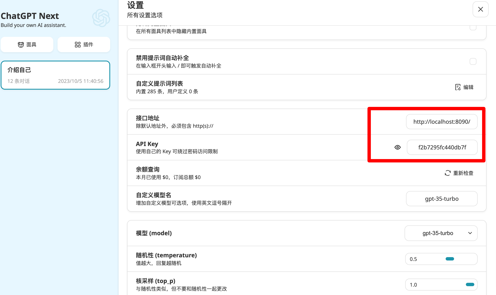

   <strong>中文</strong> | <a href="./README_EN.md">English</a>

# openai-style-api

## 用途
屏蔽不同大模型API的差异，统一用openai api标准格式使用大模型; 配置化管理不同大模型调用参数，让你在使用大模型的时候只需关注 api-key 和 messages

## 功能

- 支持多种大模型，当前已支持
  - [x] openai
  - [x] azure open ai
  - [x] claude-api 【api申请在等待列表，暂未测试】
  - [x] claude-web (将web端功能封装成openai api)
  - [x] 智谱ai
- 支持stream方式调用
- 支持open ai的第三方代理服务，比如openai-sb等

## TODO

- [ ] 配置更新接口
- [ ] 支持更多大模型
  - [ ] bingchat
  - [x] 智谱ai
  - [ ] 百度文心一言
  - [ ] 讯飞星火
  - [ ] ...

## 快速开始

1. git clone 拉取项目代码
2. `cp model-config.template model-config.json`  并按需修改配置文件model-config.json

        `{
          "f2b7295fc440db7f": {  # 此处为映射成的 api-key
              "type": "azure",  # 模型类型
              "end_point": "https://xxx.openai.azure.com/",  # azure 模型配置
              "deployment_id": "gpt-35-turbo",  # azure 模型配置
              "api_version": "2023-05-15",  # azure 模型配置
              "api_key": "xxxxxxxxxxxxxxxxxxxx",  # azure 模型配置
              "temperature": 0.8  # azure 模型配置
          }
        }`

3. 本地化部署直接 `pip install -r  requirements.txt` 后，运行 `python open-api.py`,  docker部署在目录下执行 `docker compose up -d`
4. 有了api-base: localhost:8090 和 api-key:f2b7295fc440db7f 可以使用了，下边列举了几种使用
`

## 使用方式

### curl

    curl http://localhost:8090/v1/chat/completions \
          -H "Content-Type: application/json" \
          -H "Authorization: Bearer f2b7295fc440db7f" \
          -d '{
            "messages": [
              {
                "role": "system",
                "content": "You are a helpful assistant."
              },
              {
                "role": "user",
                "content": "Hello!"
              }
            ]
          }'

### openai库调用

    import openai

    openai.api_key = "f2b7295fc440db7f"
    openai.api_base = "http://localhost:8090/v1"

    completion = openai.ChatCompletion.create(
        model="gpt-3.5-turbo", messages=[{"role": "user", "content": "Hello world"}])
    print(completion.choices[0].message.content)

### 第三方应用

[ChatGPT Next Web](https://github.com/Yidadaa/ChatGPT-Next-Web)

## 配置示例
    {
        "f2b7295fc440db7f": {
            "type": "azure",
            "api_base": "https://xxxx.openai.azure.com/",
            "deployment_id": "gpt-35-turbo",
            "api_version": "2023-05-15",
            "api_key": "xxxxxxxxxx",
            "temperature": 0.8
        },
        "GxqT3BlbkFJj": {
            "type": "openai",
            "api_base": "https://api.openai.com/v1/",
            "api_key": "xxxxxxxxxx",
            "model": "gpt-3.5-turbo"
        },
        "sb-ede1529390cc": {
            "type": "proxy",  // 代理类型
            "api_base": "https://api.openai-sb.com/v1/",
            "api_key": "xxxxxxxxxx",
            "model": "gpt-3.5-turbo"
        },
        "c115c8f5082": {
            "type": "claude-web",  
            "cookie": "xxxxxxxxxx",  // claude web cookie
            "proxies": {  // 代理，解决一些国家和地区不可用
                "https": "http://localhost:7890"
            },
            "conversation_id": "xxxxxxx",    // 会话id，可选
            "prompt": "The information in [] is the context of the conversation. Please ignore the JSON format of the context during the conversation and answer the user's latest conversation: {newMessage} \n {history}",  // prompt 通过此prompt把请求多个message转化成一次请求
            "single_conversation": true  // 单会话模式，每次访问都适用一个会话
        },
        "7c7aa4a3549f5": {
          "type": "zhipu-api",
          "api_key":"xxxxxxx",
          "model":"chatglm_lite",
          "temperature":0.8
        }
    }
    